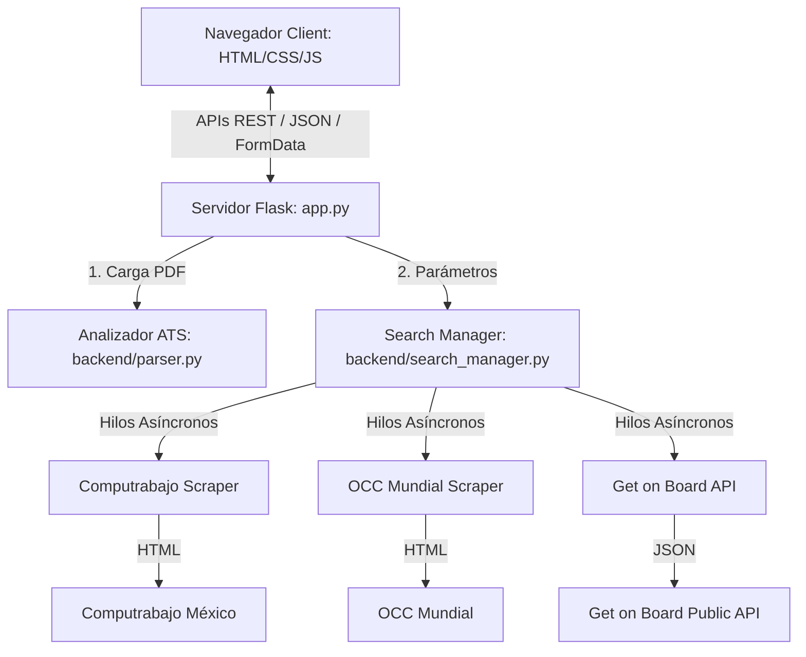

# Manual de Usuario y Documentación Técnica: PostulacionAuto Hub

**PostulacionAuto Hub** es un sistema web autónomo de búsqueda de empleo que actúa como un control de mando inteligente para candidatos (Hub de Candidato). El sistema permite cargar archivos CV en PDF de cualquier persona, extraer sus datos personales y habilidades con lógica estilo ATS, buscar ofertas en tiempo real de Veracruz (presencial) o Remoto en 3 plataformas masivas de empleo (Computrabajo, OCC Mundial y Get on Board), y calificar cada puesto según el porcentaje de coincidencia.

---

## 1. Arquitectura del Sistema

El sistema sigue una arquitectura desacoplada Cliente-Servidor (SPA) sobre Flask y Python:



---

## 2. Funcionamiento de los Módulos

### 2.1 Analizador ATS (`backend/parser.py`)
Cuando se carga un archivo PDF (o al iniciar el de fallback):
1. **Extracción**: Utiliza `pypdf` para leer las páginas y concatenar el texto.
2. **Normalización**: Traduce acentos y convierte el texto a minúsculas (`áéíóúüñ` -> `aeiouun`) para evitar falsos negativos en coincidencias de términos en español.
3. **Regex de Metadatos**:
   - *Nombre*: Escanea las primeras 4 líneas descartando correos, rutas, números o líneas demasiado largas (>40 caracteres).
   - *Email*: Patrón regular `[\w\.-]+@[\w\.-]+\.\w+`.
   - *Teléfono*: Detecta formatos internacionales y nacionales con separadores y prefijos opcionales.
   - *Ubicación*: Busca ocurrencias de ciudades principales (Veracruz, Puebla, Monterrey, etc.).
4. **Coincidencia Semántica de Habilidades**: Compara el texto normalizado contra un glosario clasificado de más de 100 tecnologías. Utiliza límites de palabras (`\b`) para palabras sencillas como `Go` o `Java` para evitar falsos positivos (como "google" o "javascript"), y búsquedas de subcadena para términos complejos como `.NET` o `C#`.

### 2.2 Motores de Búsqueda (Scrapers)
- **Computrabajo (`backend/scrapers/computrabajo.py`)**: Utiliza `requests` y `BeautifulSoup` simulando cabeceras de navegador. Genera URLs amigables SEO basadas en slugs (`/trabajo-de-php-en-veracruz` o `/trabajo-de-php-remoto`). Extrae el título, empresa, salario, fecha de publicación y enlace.
- **OCC Mundial (`backend/scrapers/occ.py`)**: Realiza consultas directas a los listados de OCC. Al detectar que las tarjetas dinámicas de OCC se estructuran en base a selectores Tailwind (`grid-cols-12`, `col-span-10`, etc.), extrae el ID de la oferta del atributo `data-id` y reconstruye el enlace absoluto (`/empleo/oferta/{job_id}`).
- **Get on Board (`backend/scrapers/getonbrd.py`)**: Conecta con el endpoint público v0 `/api/v0/search/jobs?query=...` de Get on Board para vacantes del sector tecnológico. Filtra los resultados en memoria según la ubicación (Veracruz o Remoto) y consulta en paralelo las APIs de perfiles de empresas (`/companies/{id}`) para mapear los nombres de marcas y postulantes de forma exacta.

### 2.3 Gestor de Búsqueda (`backend/search_manager.py`)
1. **Ejecución en Paralelo**: Lanza consultas de palabras clave de manera simultánea en hilos asíncronos mediante `concurrent.futures.ThreadPoolExecutor` para maximizar la velocidad.
2. **Deduplicación**: Unifica las respuestas de las 3 plataformas usando el enlace (`URL`) como clave única en un diccionario.
3. **Match Score %**: Compara los requisitos del puesto con las habilidades del CV del candidato. Suma puntos por cada tecnología coincidente (peso mayor si está en el título, peso menor si está en la descripción). Otorga bonificaciones a las habilidades principales. El resultado se normaliza con un tope de 100%.
4. **Filtro de Límite**: Ordena la lista de forma descendente por porcentaje de coincidencia y recorta la lista a las mejores 20 ofertas.

---

## 3. Endpoints de la API REST

| Endpoint | Método | Descripción | Parámetros / Cuerpo |
| :--- | :---: | :--- | :--- |
| `/` | `GET` | Sirve la aplicación de una sola página (SPA). | Ninguno |
| `/api/profile` | `GET` | Retorna el perfil del candidato activo en memoria JSON. | Ninguno |
| `/api/upload-cv` | `POST` | Recibe un archivo PDF de CV, lo procesa con el ATS y actualiza el perfil activo. | Form-Data: `cv` (archivo PDF) |
| `/api/search` | `GET` | Ejecuta los scrapers asíncronos y retorna las ofertas ordenadas. | `keywords` (lista), `location` (remoto/veracruz), `max_results` (número) |
| `/api/export` | `POST` | Genera un archivo CSV descargable con codificación Excel UTF-8. | JSON: `{ "jobs": [...] }` |

---

## 4. Manual de Uso del Dashboard

1. **Subida de CV**: Arrastra un archivo PDF o haz clic sobre la zona discontinua que dice **"Subir otro CV"**. Una vez que el backend termine de procesar el archivo, aparecerá una alerta de confirmación y el panel lateral izquierdo se actualizará con el nombre, título, datos de contacto y tags de habilidades del nuevo candidato.
2. **Configuración de Búsqueda**:
   - **Palabras Clave**: Se auto-completan con las 5 habilidades principales del CV cargado. Puedes editarlas, borrarlas o añadir más (separadas por comas).
   - **Modalidad**: Elige **Veracruz (Presencial)** para ofertas locales en la ciudad o **Remoto** para teletrabajo a nivel nacional/global.
   - **Límite**: Ajusta la barra deslizadora (por defecto en 20) para determinar cuántas vacantes procesar.
3. **Ejecución de Búsqueda**: Haz clic en **Buscar Empleos**. El portal mostrará una barra de progreso mientras los crawlers escanean la web.
4. **Control de Ofertas**:
   - **Match %**: Indica qué tan compatible es la vacante. Puestos con alta compatibilidad (>75%) se resaltan con un borde lateral violeta.
   - **Guardar**: Haz clic en el botón de marcador (icono de bandera) para guardar ofertas de tu interés. Su estado se guardará en el almacenamiento local del navegador (`localStorage`) y se mantendrá incluso si recargas la página.
   - **Descartar**: Haz clic en el icono del ojo tachado para atenuar / ocultar ofertas no deseadas.
   - **Ver Detalles**: Abre un modal elegante con la descripción, salario, habilidades y el botón de enlace directo para postularte en la web origen.
5. **Exportación**: Haz clic en **Exportar CSV** en la barra superior derecha para descargar un reporte de Excel con la lista de empleos que se muestra en pantalla.

---

## 5. Mantenimiento y Personalización

### Modificar el Glosario de Habilidades ATS
Si deseas que el ATS reconozca nuevas habilidades o cambie su categorización, edita la variable `SKILLS_GLOSSARY` en el archivo [parser.py](file:///c:/Users/siste/OneDrive/Documentos/PostulacionAuto/backend/parser.py#L5-L42). Solo añade la palabra exacta (respetando mayúsculas/minúsculas de tu preferencia) en la lista correspondiente:

```python
SKILLS_GLOSSARY = {
    "languages": [
        "PHP", "Java", "Python", "Rust", "MyNewLanguage" # Añadido aquí
    ],
    ...
}
```
El motor lo procesará automáticamente en la siguiente carga de CV.
